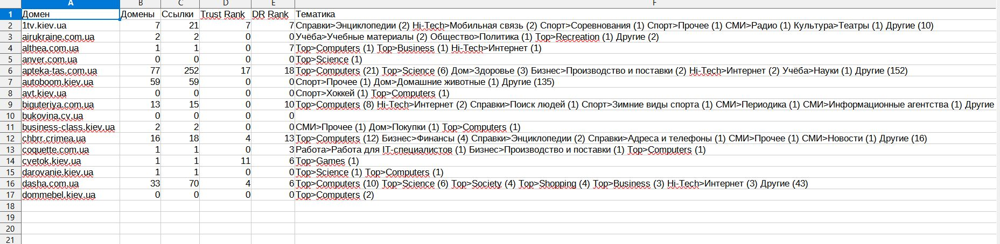

Скрипт не умеет авторизироваться самостоятельно, поэтому после открытия браузера найдите кнопку Авторизация и введите емейл и пароль.
Скрипт берет список ссылок из файла site.txt и проверяет их в https://ru.megaindex.com/backlinks
Парсит Trust DR RANK и тематику ссылок.
 Для парсинга использует Selenium, поэтому обновите свой chromedriver.exe в папке для вашей версии Chrome.
 Результат парсинга будет в Сайты.csv
 
 
 Возможна доработка под ваши потребности.
 